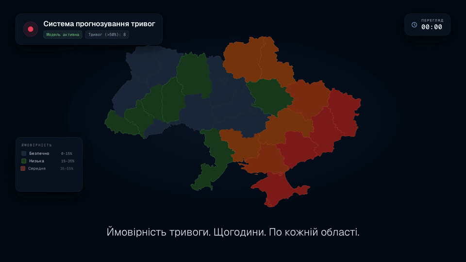
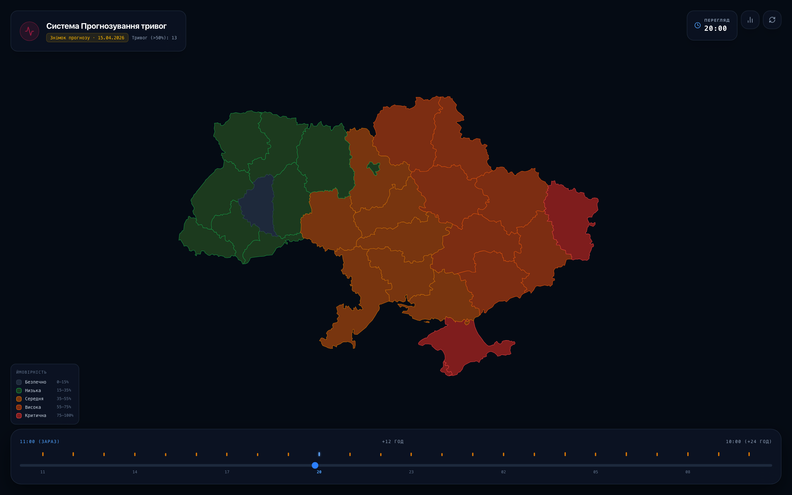
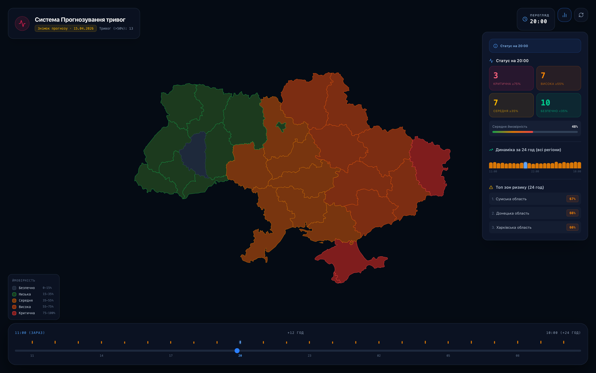
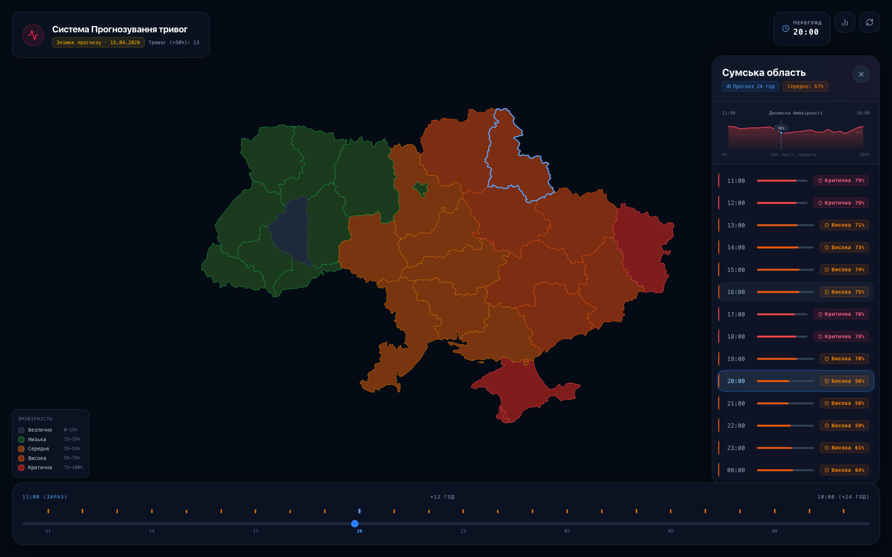
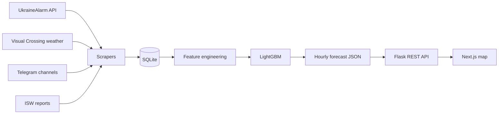

<div align="center">

# Air Raid Alert Forecast · Ukraine

**Hour-by-hour probability of an air raid alert for all 25 regions of Ukraine, 24 hours ahead.**




[**Live demo**](https://alarm-forecast.vercel.app) · [Watch the video](docs/media/demo.mp4) · [Screenshots](#screenshots) · [How it works](#how-it-works) · [Run locally](#getting-started)

</div>

## Overview

The system turns four public data streams — alert history, weather forecasts, Telegram
monitoring channels and ISW war reports — into a per-region forecast that refreshes every
hour. A LightGBM model scores each of the 25 regions for each of the next 24 hours, a Flask
API serves the result, and an interactive map lets you scrub through the day and drill into
any region.

- **25 regions × 24 hours**, recomputed hourly; the model is retrained weekly
- **4 data sources**, including **385,114** Telegram messages collected over four years
- **ROC-AUC 0.91 · F1 0.73** on held-out data under time-series cross-validation
- **Interactive map** with a 24-hour timeline, regional risk stats and hourly breakdowns

> **Live demo:** [alarm-forecast.vercel.app](https://alarm-forecast.vercel.app) shows a snapshot of real
> model output — the forecast made on 15 April 2026 at 19:20, covering 19:00 that day to 18:00 the next.

## Screenshots

<table>
  <tr>
    <td colspan="2"></td>
  </tr>
  <tr>
    <td width="50%"></td>
    <td width="50%"></td>
  </tr>
  <tr>
    <td align="center"><sub>Status for the selected hour and the top risk regions</sub></td>
    <td align="center"><sub>Hourly probability curve and breakdown for one region</sub></td>
  </tr>
</table>

## How it works



1. **Collect** — scheduled scrapers pull alert status, weather, Telegram posts and ISW reports into SQLite.
2. **Engineer** — hourly features per region: alert history, neighbouring-region activity, weather, and NLP signals from Telegram text.
3. **Predict** — the LightGBM pipeline scores every region for the next 24 hours, once an hour.
4. **Serve** — Flask exposes `GET /forecast`; the Next.js app renders it as a choropleth with a timeline.

## Model

| Metric (test, time-series CV) | LightGBM |
| --- | --- |
| ROC-AUC | 0.911 ± 0.012 |
| PR-AUC | 0.831 ± 0.025 |
| F1 | 0.727 ± 0.024 |
| Precision / Recall | 0.722 / 0.740 |

LightGBM was selected after comparing it with logistic regression, linear regression,
decision tree, LinearSVC and XGBoost baselines — see [`machine learning/`](machine%20learning).

## Tech stack

| Area | Tools |
| --- | --- |
| Data collection | Python, Telethon, Requests, BeautifulSoup |
| Storage | SQLite, SQLAlchemy |
| NLP & features | pandas, NumPy, Pymorphy3, TF-IDF, CountVectorizer |
| Modelling | LightGBM, scikit-learn, XGBoost, Jupyter |
| Backend | Flask, Flask-CORS, uWSGI, cron |
| Frontend | Next.js 16, React 19, Tailwind CSS 4, react-simple-maps, Framer Motion |
| Infrastructure | AWS EC2, Vercel |

## My contribution

This is a fork of the team project [GeoChernykh/AlarmForecast](https://github.com/GeoChernykh/AlarmForecast).
I owned the Telegram data track, the baseline models and the frontend:

- **Telegram pipeline** — a Telethon scraper that collected **385,114 messages** from 4 monitoring
  channels, covering Feb 2022 – Mar 2026.
- **NLP features** — cleaned and lemmatised the text (Pymorphy3) and built **20 hourly features**
  (TF-IDF, CountVectorizer, message-volume and threat signals) across **35,441 hours**.
- **Baseline models** — linear regression (F1 0.67) and a GridSearch-tuned decision tree
  (F1 0.68, ROC-AUC 0.80), evaluated with region-aware time-series cross-validation. They set
  the bar the production model had to beat.
- **Alert data client** — UkraineAlarm API v3 client for all 25 regions, with timeouts and retries.
- **Frontend** — the whole interactive map in `frontend/tactical-map`: choropleth, 24-hour
  timeline, risk statistics, region panel with hourly chart, and the API integration.

The production LightGBM pipeline, database layer and EC2 deployment were built by
[@GeoChernykh](https://github.com/GeoChernykh), with additional models and EDA by
[@noobikspb](https://github.com/noobikspb).

## Getting started

**Backend** — Python 3.13

```bash
python -m venv .venv && source .venv/bin/activate
pip install -r requirements.txt
cp .env.example .env    # add your API keys
python main.py          # http://127.0.0.1:5000/forecast
```

**Frontend** — Node.js 20+

```bash
cd frontend/tactical-map
npm install
cp .env.example .env.local    # points the map at the local API
npm run dev                   # http://localhost:3000
```

Without `NEXT_PUBLIC_API_URL` the map shows a bundled snapshot of real model output, so the
frontend runs on its own.

## Project structure

```
app/
  api/             Flask endpoints: /forecast, /generate_forecast
  core/scraping/   alerts, weather, Telegram and ISW collectors
  core/features/   per-source feature engineering and merging
  core/model_scripts/  hourly inference and weekly retraining
  db/              SQLite access layer
  models/          trained LightGBM pipeline and preprocessors
eda/               exploratory analysis notebooks
machine learning/  model experiments and comparison
frontend/tactical-map/  Next.js forecast map
main.py            Flask entry point
```

## Deployment

The backend runs on AWS EC2 under uWSGI with cron jobs for hourly inference and weekly
retraining. The frontend deploys to Vercel from `frontend/tactical-map`. Step-by-step
instructions are in [docs/DEPLOYMENT.md](docs/DEPLOYMENT.md).

## Data sources

[UkraineAlarm API](https://api.ukrainealarm.com/) · [Visual Crossing Weather](https://www.visualcrossing.com/) ·
[Institute for the Study of War](https://www.understandingwar.org/) · public Telegram monitoring channels
